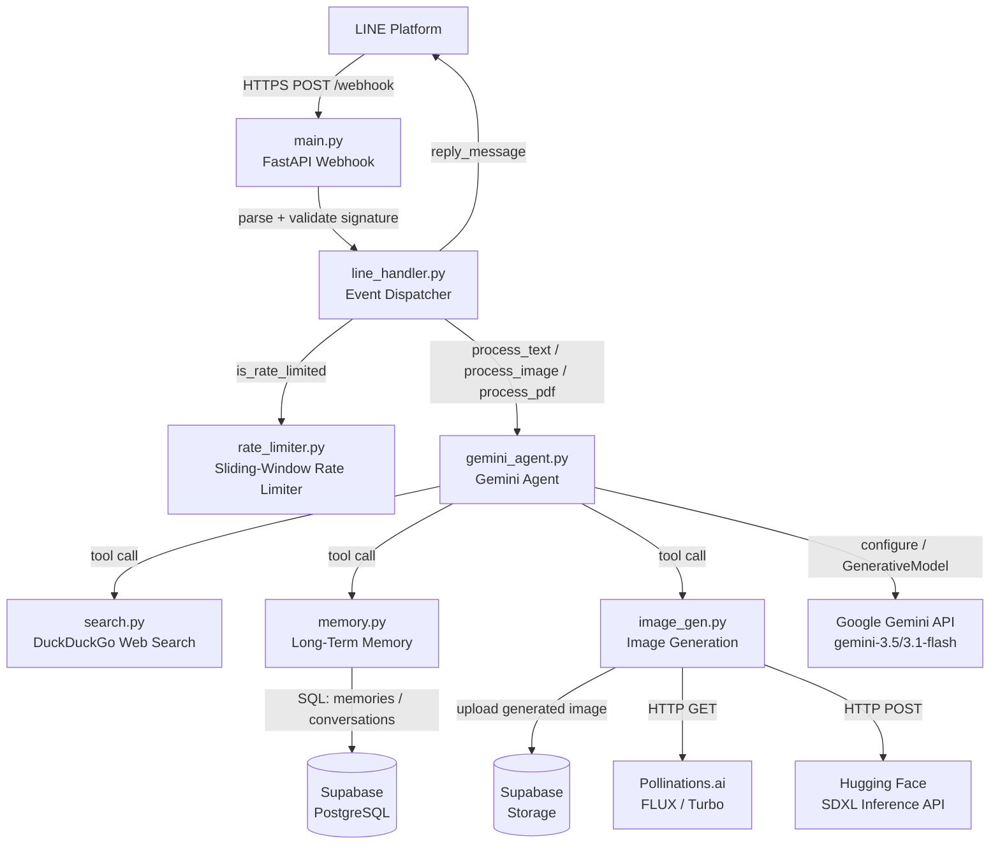

<!-- generated-by: gsd-doc-writer -->
# Architecture

## System Overview

This is a personal LINE Bot AI assistant built on FastAPI. It exposes a single HTTPS webhook endpoint that receives LINE messaging events, applies per-user rate limiting, and dispatches to a Gemini generative AI agent. The agent is equipped with five callable tools — web search, long-term memory save/recall/delete, and image generation — and uses a multi-key, multi-model fallback chain to maximise availability under free-tier API quotas. Persistent state (long-term memories and conversation history) is stored per-user in Supabase PostgreSQL. Generated images are uploaded to Supabase Storage and returned to LINE as native image messages. The application runs as a single Docker container deployed on Render.com.

---

## Component Diagram



---

## Data Flow

### Text message request

1. LINE Platform sends a signed `POST /webhook` request to the FastAPI server.
2. `main.py` validates the `X-Line-Signature` header using `LINE_CHANNEL_SECRET`. Invalid signatures are rejected with HTTP 400.
3. The parsed event list is passed to `line_handler.handle_line_events()`.
4. For each `MessageEvent`, `line_handler` checks `is_rate_limited(user_id)`. If the user has sent 10 or more messages within the last 60 seconds, a rate-limit reply is returned immediately and processing stops.
5. For a `TextMessageContent` event, `gemini_agent.process_text(user_id, text)` is called in a thread executor (keeping the async event loop unblocked).
6. `process_text` loads the 6 most recent conversation turns from Supabase (`conversations` table) and the 5 most recent memories (`memories` table) and prepends them to the user input as an XML-tagged context block.
7. `_call_with_fallback` iterates over the model chain (`gemini-3.5-flash` → `gemini-3.1-flash` → `gemini-3.1-flash-lite`) and over each configured API key. The first combination that does not raise `ResourceExhausted` or `ServiceUnavailable` is used.
8. The Gemini model runs with `enable_automatic_function_calling=True`, so tool calls (web search, memory operations, image generation) are dispatched automatically and transparently.
9. The model reply is checked for an `IMAGE_URL:` marker. If found, the URL is split out and returned alongside the text reply.
10. Both the user message and the assistant reply are persisted to `conversations`.
11. `line_handler` constructs one or more `TextMessage` objects (chunked at 4500 characters) and optionally an `ImageMessage`, then sends them back to LINE via `MessagingApi.reply_message`.

### Image / PDF message request

For `ImageMessageContent`, the binary image is downloaded from LINE's content API, decoded with Pillow, and sent directly to Gemini's multimodal `generate_content` endpoint (no tool-calling loop).

For `FileMessageContent` with a `.pdf` extension, `pypdf` extracts text from up to the first 20 pages. The extracted text (capped at 8000 characters) is passed to Gemini as a summarisation prompt.

---

## Key Abstractions

| Abstraction | File | Description |
|---|---|---|
| `handle_line_events(events)` | `app/line_handler.py` | Top-level async dispatcher; routes each LINE event to the correct processing path |
| `process_text(user_id, text)` | `app/gemini_agent.py` | Orchestrates context assembly, model fallback, tool execution, and reply parsing for text messages |
| `process_image(user_id, image_bytes, caption)` | `app/gemini_agent.py` | Sends raw image bytes to Gemini for multimodal analysis |
| `process_pdf(user_id, pdf_bytes, filename)` | `app/gemini_agent.py` | Extracts text from PDF pages and requests a summarisation from Gemini |
| `_call_with_fallback(user_id, full_input, history)` | `app/gemini_agent.py` | Iterates `MODEL_CHAIN × GEMINI_API_KEYS` until one combination succeeds; raises `RuntimeError` only if all are exhausted |
| `_make_tools(user_id)` | `app/gemini_agent.py` | Returns the five Gemini tool functions as closures bound to `user_id` |
| `is_rate_limited(user_id)` | `app/rate_limiter.py` | In-process sliding-window rate limiter (10 req / 60 s per user) |
| `save_memory / recall_memories / delete_memory` | `app/memory.py` | Per-user CRUD operations on the `memories` table in Supabase |
| `save_conversation / get_recent_conversations` | `app/memory.py` | Per-user conversation history persistence in the `conversations` table |
| `generate_image(prompt)` | `app/image_gen.py` | Image generation with a three-provider fallback chain; uploads result to Supabase Storage |
| `search_web(query)` | `app/search.py` | DuckDuckGo full-text search returning up to 5 formatted results |

---

## Directory Structure Rationale

```
LINEBOT/
├── app/
│   ├── main.py          # FastAPI application instance and /webhook route
│   ├── line_handler.py  # LINE event type routing and LINE Messaging API reply logic
│   ├── gemini_agent.py  # Gemini model configuration, tool definitions, and fallback logic
│   ├── memory.py        # Supabase-backed long-term memory and conversation history
│   ├── image_gen.py     # Image generation with Pollinations.ai and Hugging Face fallback
│   ├── search.py        # DuckDuckGo web search wrapper
│   ├── rate_limiter.py  # In-process sliding-window rate limiter
│   └── config.py        # Environment variable loading and Gemini API key collection
├── docs/
│   └── ARCHITECTURE.md  # This file
├── Dockerfile           # python:3.11-slim image; CMD runs uvicorn on $PORT
└── requirements.txt     # Python package dependencies
```

All application code lives in a single `app/` package. Each file has a single well-scoped responsibility, which keeps the dependency graph shallow: `main.py` → `line_handler.py` → `gemini_agent.py` → `memory.py`, `search.py`, `image_gen.py`. `config.py` is imported by all modules that need environment values. `rate_limiter.py` is called only by `line_handler.py`.

---

## Model Fallback Chain

The system supports up to three Gemini API keys (`GEMINI_API_KEY`, `GEMINI_API_KEY_2`, `GEMINI_API_KEY_3`), each from a separate Google account with its own independent quota. The fallback order cycles keys for each model tier before moving down:

```
gemini-3.5-flash  + Key1 → gemini-3.5-flash  + Key2 → gemini-3.5-flash  + Key3
gemini-3.1-flash  + Key1 → gemini-3.1-flash  + Key2 → gemini-3.1-flash  + Key3
gemini-3.1-flash-lite + Key1 → gemini-3.1-flash-lite + Key2 → gemini-3.1-flash-lite + Key3
```

`ResourceExhausted` and `ServiceUnavailable` exceptions advance to the next key. Any other exception skips all remaining keys for that model and advances to the next model tier.

---

## Image Generation Fallback Chain

Image generation follows a three-provider fallback in `image_gen.py`:

| Priority | Provider | Model | Auth Required |
|---|---|---|---|
| A | Pollinations.ai | FLUX (1024×1024) | None |
| B | Hugging Face Inference API | Stable Diffusion XL | `HF_TOKEN` |
| C | Pollinations.ai | Turbo (512×512) | None |

On success, the generated image bytes are uploaded to Supabase Storage (`images` bucket) to obtain a stable public URL. If the Supabase upload fails, the raw Pollinations URL is returned as a fallback for providers A and C.

---

## External Dependencies

| Service | Purpose | Auth |
|---|---|---|
| LINE Messaging API | Receive webhook events and send replies | `LINE_CHANNEL_SECRET`, `LINE_CHANNEL_ACCESS_TOKEN` |
| Google Gemini API | Language model and multimodal inference | Up to 3 × `GEMINI_API_KEY` |
| Supabase (PostgreSQL) | `memories` and `conversations` tables | `SUPABASE_SERVICE_ROLE_KEY` (preferred) or `SUPABASE_ANON_KEY` |
| Supabase Storage | Persistent image hosting (`images` bucket) | Same Supabase client |
| Pollinations.ai | Free text-to-image generation | None |
| Hugging Face Inference API | SDXL text-to-image fallback | `HF_TOKEN` (optional) |
| DuckDuckGo Search | Web search via `duckduckgo-search` library | None |
